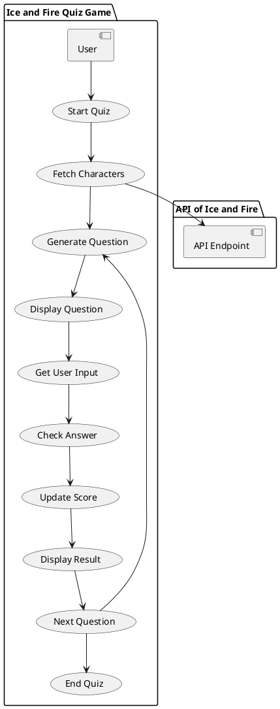
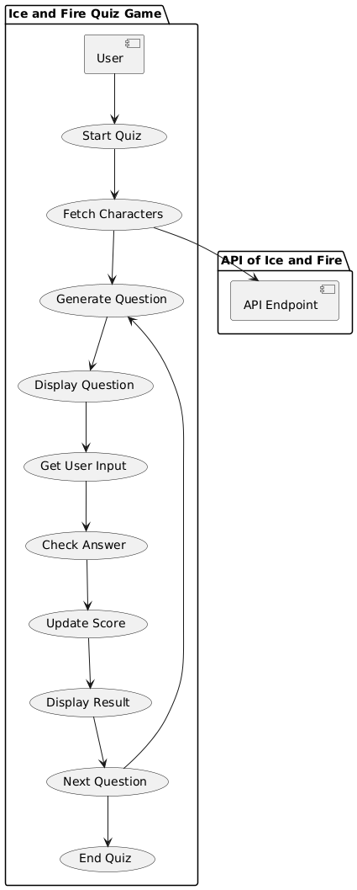

```markdown
# Ice and Fire Quiz Game

A fun and challenging quiz game based on the "A Song of Ice and Fire" series, using the API of Ice and Fire. Built with Deno, TypeScript, and Bun.

## Table of Contents

- [Installation](#installation)
- [Usage](#usage)
- [Project Structure](#project-structure)
- [Features](#features)
- [Contributing](#contributing)
- [License](#license)

## Installation

### Prerequisites

- [Deno](https://deno.land/manual@v1.28.3/getting_started/installation)
- [Bun](https://bun.sh/docs/installation)

### Steps

1. Clone the repository:
   ```sh
   git clone https://github.com/Azterix101/ice-and-fire-quiz.git
   cd ice-and-fire-quiz
   ```

2. Install dependencies using Bun:
   ```sh
   bun install
   ```

## Usage

To start the quiz game, run the following command:
```sh
deno run --allow-net --allow-read --allow-write src/main.ts
```

## Project Structure

```
ice-and-fire-quiz/
├── src/
│   ├── api.ts        # API client for fetching character data
│   ├── main.ts       # Main application logic
│   └── quiz.ts       # Quiz logic and question generation
├── .gitignore        # Git ignore file
├── bun.lockb         # Bun lock file
├── README.md         # Project documentation
└── package.json      # Bun package file
```

## Features

- **Multiple-Choice Questions**: Generates challenging multiple-choice questions based on character aliases.
- **Scoring System**: Tracks the user's score throughout the quiz.
- **Error Handling**: Gracefully handles errors and continues the quiz.

Sure! Here's a high-level design (HLD) for the Ice and Fire Quiz Game project using PlantUML. This diagram will illustrate the main components and their interactions.

### PlantUML Diagram



### Explanation

- **User**: The person interacting with the quiz game.
- **Start Quiz**: The initial action to start the quiz.
- **Fetch Characters**: Fetches multiple characters from the API of Ice and Fire.
- **Generate Question**: Generates a quiz question based on the fetched characters.
- **Display Question**: Displays the generated question and options to the user.
- **Get User Input**: Captures the user's answer.
- **Check Answer**: Checks if the user's answer is correct.
- **Update Score**: Updates the user's score based on the answer.
- **Display Result**: Displays the result of the current question.
- **Next Question**: Proceeds to the next question or ends the quiz if all questions are answered.
- **API Endpoint**: Represents the API of Ice and Fire used to fetch character data.





## Contributing

Contributions are welcome! Please follow these steps to contribute:

1. Fork the repository.
2. Create a new branch (`git checkout -b feature-branch`).
3. Make your changes.
4. Commit your changes (`git commit -m 'Add new feature'`).
5. Push to the branch (`git push origin feature-branch`).
6. Open a pull request.

## License

This project is licensed under the MIT License. See the [LICENSE](LICENSE) file for details.
```

Feel free to customize this `README.md` file to better suit your project's needs. If you have any more questions or need further assistance, let me know! 😊